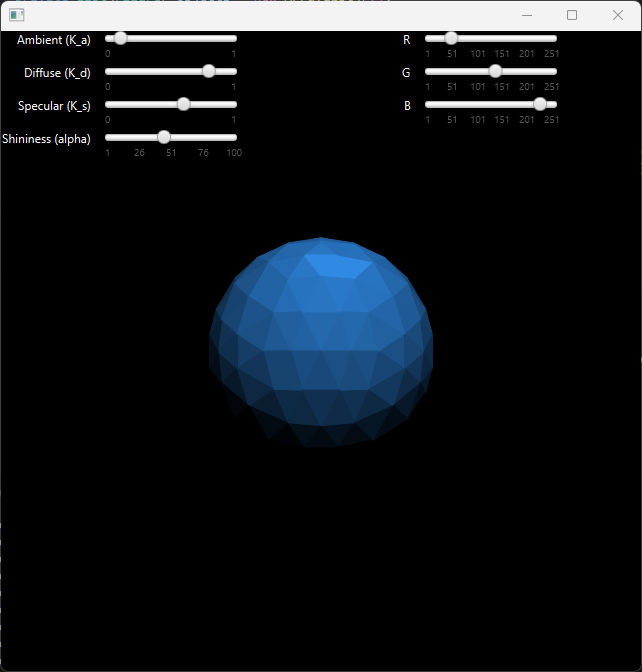
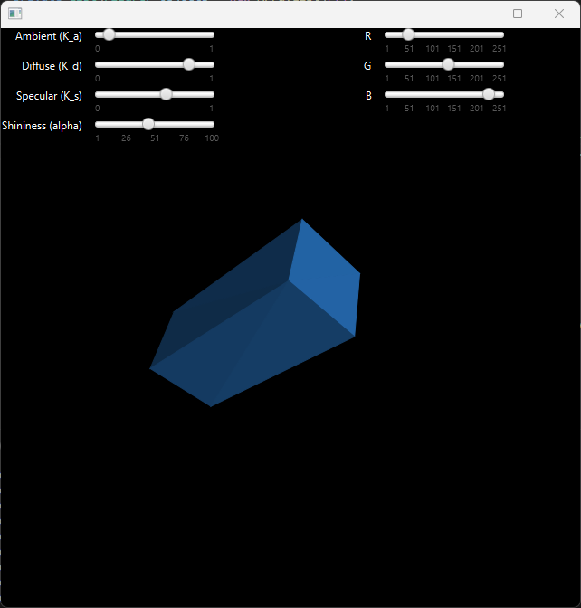

[:gb: English version :gb:](README_ENG.md)

## Projekt
 

Projekt zakłada stworzenie wirtualnej kamery korzystając z wyświetlania prostych elementów graficznych (np. punkt, linia, wielobok) w oknie aplikacji z uwzględnieniem prawidłowego wyświetlania ścian prezentowanych obiektów. Wymagane jest zrealizowanie implementacji wykonującej wszystkie niezbędne obliczenia i wyświetlającej prezentowane elementy w oknie aplikacji zgodnie z ludzką percepcją ze szczególnym naciskiem na prawidłowe zachowanie wypełnienia obiektów na całej powierzchni w czasie manipulowania położenia kamerą. Sama kamera powinna umożliwiać poruszanie się w dowolnym kierunku, manipulowanie kątem patrzenia, wykonywanie przybliżenia (ang. zoom in), oraz oddalenia (ang. zoom out) z zachowaniem odpowiedniej perspektywy charakteryzujące ludzkie postrzegania rzeczywistości.

## Figury
:small_blue_diamond: Icosfera złożona z 320 trójkątów:

:small_blue_diamond: Icosfera złożona z 20480 trójkątów:

:small_blue_diamond: Dwa nakładające się prostopadłościany:

:small_blue_diamond: Przechylony prostopadłościan:

## Poruszanie
Poruszanie kamerą odbywa się za pomocą przekształceń macierzowych prezentowanych obiektów. 
Poniżej zestawiono sposób poruszania.

|Przycisk|Efekt|
|-|-|
|W A S D|Ruch w kierunkach horyzontalnych|
|Space|Ruch w górę|
|Shift|Ruch w dół|
|Q|Obrót kamerą w lewo|
|E|Obrót kamerą w prawo|
|Z|Przybliżenie (ang. zoom in)|
|X|Oddalenie (ang. zoo out)|

## Oświetlenie
W aplikacji zaimplementowano [model oświetlnia Phonga](https://en.wikipedia.org/wiki/Phong_reflection_model).
> [!NOTE]
> Więcej informacji w `docs/Sprawozdanie.pdf`

Poniżej przedstawiono działanie poszczególnych składowych modelu.

|Składowa|Znaczenie w modelu|
|-|-|
|Ks| stała odbicia lustrzanego, współczynnik odbicia wyrazu lustrzanego światła przychodzącego|
|Kd| stała odbicia rozproszonego, współczynnik odbicia wyrazu rozproszonego światła przychodzącego (odbicie lambertowskie)|
|Ka| stała odbicia otoczenia, współczynnik odbicia wyrazu otoczenia obecnego we wszystkich punktach w renderowanej scenie|
|α|stała połysku dla materiału, która jest większa dla powierzchni, które są gładsze i bardziej lustrzane|

## Uruchomienie
W celu uruchomienia projektu wymagana jest **Java 11** i **maven**.

Po zainstalowaniu wymaganego oprogramowania wystarczy uruchomić `VirtualCamera\camera\src\main\java\app\Launcher.java`.

> [!TIP]
> Wtyczka *Extension Pack for Java* dla **Visual Studio Code** pozwala na uruchomienie bezpośrednio z interfejsu.
