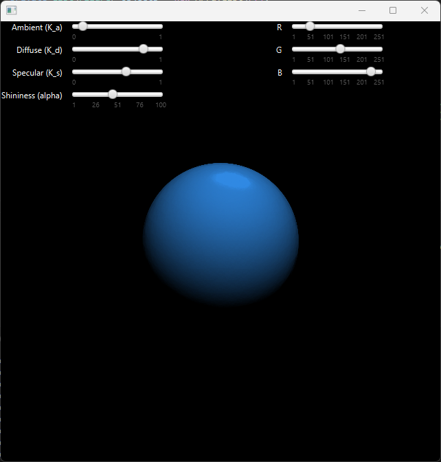

# Project
The project involves creating a virtual camera by displaying simple graphic elements (e.g., point, line, polygon) in an application window, ensuring the correct display of object surfaces. The implementation must perform all necessary calculations and display the elements in the application window according to human perception, with particular emphasis on correctly filling objects across their entire surface while manipulating the camera position. The camera should allow movement in any direction, angle manipulation, zooming in, and zooming out, maintaining a perspective that aligns with human perception of reality.

## Figures
:small_blue_diamond: Icosphere composed of 320 triangles:

:small_blue_diamond: Icosphere composed of 20480 triangles:

:small_blue_diamond: Two overlapping prisms:

:small_blue_diamond: Tilted prism:

## Movement
Camera movement is achieved through matrix transformations of the presented objects. Below is a table summarizing the movement controls.

|Button|Effect|
|-|-|
|W A S D|Horizontal movements|
|Space|Move up|
|Shift|Move down|
|Q|Rotate camera left|
|E|Rotate camera right|
|Z|Zoom in|
|X|Zoom out|

## Lighting
The application implements the [Phong lighting model](https://en.wikipedia.org/wiki/Phong_reflection_model).
> [!NOTE]
> More information in `docs/Sprawozdanie.pdf`

Below is an explanation of the components of the model.

|Component|Meaning in the model|
|-|-|
|Ks| Specular reflection constant, coefficient of specular reflection of incoming light|
|Kd| Diffuse reflection constant, coefficient of diffuse reflection of incoming light (Lambertian reflection)|
|Ka| Ambient reflection constant, coefficient of ambient reflection present in all points in the rendered scene|
|α|Shininess constant for the material, which is higher for smoother and more mirror-like surfaces|

## Launch
To run the project, **Java 11** and **maven** are required.

Once the necessary software is installed, simply run `VirtualCamera\camera\src\main\java\app\Launcher.java`.

> [!TIP]
> The *Extension Pack for Java* plugin for **Visual Studio Code** allows you to run the project directly from the interface.
